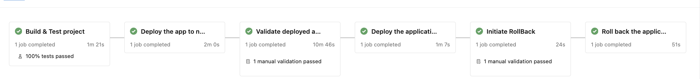

```markdown
# Blue-Green Deployment

## Overview

This repository contains an implementation of the Blue-Green Deployment strategy, which allows for seamless application updates with minimal downtime. This approach involves maintaining two identical environments: **Blue** (current live version) and **Green** (new version). This allows for quick switching between versions to ensure high availability and reliability.

## Table of Contents

- [Features](#features)
- [Architecture](#architecture)
- [Setup](#setup)
- [Usage](#usage)
- [Deployment Process](#deployment-process)
- [Contributing](#contributing)
- [License](#license)

## Features

- Seamless switching between Blue and Green environments
- Automated deployment and rollback capabilities
- Integration with CI/CD pipelines
- Monitoring and logging for both environments

## Architecture



This diagram illustrates the architecture of the Blue-Green Deployment strategy implemented in this project.

## Setup

### Prerequisites

- [Docker](https://www.docker.com/get-started)
- [Kubernetes](https://kubernetes.io/docs/setup/)
  
### Installation

1. Clone the repository:
   ```bash
   git clone https://github.com/yourusername/blue-green-d.git
   cd blue-green-d
   ```

2. Build the Docker images:
   ```bash
   docker build -t your-image-name:latest .
   ```

3. Deploy to Kubernetes:
   ```bash
   kubectl apply -f k8s/deployment.yaml
   ```

## Usage

To switch between Blue and Green environments, use the following commands:

- To set the Green environment live:
   ```bash
   kubectl apply -f k8s/green-service.yaml
   ```

- To set the Blue environment live:
   ```bash
   kubectl apply -f k8s/blue-service.yaml
   ```

## Deployment Process

1. **Prepare the Green environment** with the new version of the application.
2. **Run tests** to ensure the Green environment works as expected.
3. **Switch traffic** to the Green environment using the commands above.
4. **Monitor** the performance and logs of the Green environment.
5. If issues arise, quickly **rollback** to the Blue environment.

## Contributing

Contributions are welcome! Please open an issue or submit a pull request for any enhancements or bug fixes.

1. Fork the repository.
2. Create a new branch (`git checkout -b feature/YourFeature`).
3. Commit your changes (`git commit -m 'Add some feature'`).
4. Push to the branch (`git push origin feature/YourFeature`).
5. Open a pull request.

## License

This project is licensed under the MIT License - see the [LICENSE](LICENSE) file for details.

## Acknowledgements

- [Blue-Green Deployment](https://martinfowler.com/bliki/BlueGreenDeployment.html) - Martin Fowler
- Other resources and inspirations.
```

### Instructions for Use
- Replace `path/to/architecture-diagram.png` with the actual path to your architecture diagram image.
- Update the repository link, Docker image names, and any other specific details related to your project.
- Make sure to include any additional sections as needed for your project.

Feel free to ask if you need any more adjustments!
